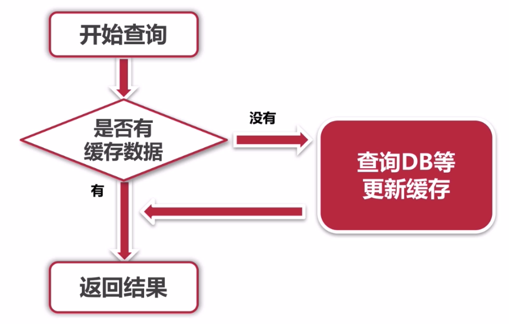

### Redis

客户端连接：

进入windows客户端安装目录，执行以下命令

```
redis-cli -h 103.10.0.103 -p 6379 -a Aq1sw2de3
```

#### 高并发缓存问题



##### 缓存一致性问题


##### 缓存穿透

在高并发场景下，如果某个key在缓存中没有命中，为了容错性的考虑，会在数据库中查询，从而导致大量请求到达数据库，而当该key本身对应的value为空的情况下，这些查询就是明月必要的，从而导致了巨大的冲击和压力，主要解决方式有：

1. 缓存空的对象及空的集合（对象可以用标示来区分，集合不要为null，null时需要查询数据库），适合命中率不高，但频繁更新的数据
2. 


##### 缓存抖动

比雪崩更轻微的现象


##### 缓存的雪崩现象

