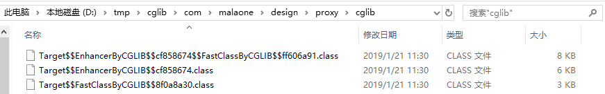

### 静态代理


### JDK动态代理


### CGLIB动态代理

#### 实例代码

被代理类：

```java
public class Target {

    public Target() {
        System.out.println("class constructor: Target()");
    }

    /**
     * 该方法不能被子类覆盖,Cglib是无法代理final修饰的方法的
     */
    final public String finalMethod(String name) {
        System.out.println("Target:finalMethod>>" + name);
        return null;
    }

    public void sayHello() {
        System.out.println("Target:sayHello");
    }
}
```

cglib方法拦截器：

```java
public class CglibMethodInterceptor implements MethodInterceptor {
    @Override
    public Object intercept(Object o, Method method, Object[] objects, MethodProxy methodProxy) throws Throwable {
        System.out.println("before method: " + method.getName());
        Object object = methodProxy.invokeSuper(o, objects);
        System.out.println("after method: " + method.getName());
        return object;
    }
}
```

客户端：

```java
public class Main {

    public static void main(String[] args) {
        // 代理类class文件存入本地磁盘方便我们反编译查看源码
        System.setProperty(DebuggingClassWriter.DEBUG_LOCATION_PROPERTY, "D:\\tmp\\cglib");
        // 通过CGLIB动态代理获取代理对象的过程
        Enhancer enhancer = new Enhancer();
        // 设置代理类的父类
        enhancer.setSuperclass(Target.class);
        // 设置enhancer的回调对象
        enhancer.setCallback(new CglibMethodInterceptor());
        // 创建代理对象
        Target proxy = (Target) enhancer.create();
        // 通过代理对象调用目标方法
        proxy.sayHello();
        proxy.finalMethod("aaa");
    }
}
```

运行结果（可以看到，final 方法没有增强）：

```
class constructor: Target()
before method: sayHello
Target:sayHello
after method: sayHello
Target:finalMethod>>aaa
```

#### 代理类

首先看一下生成的类：



实例包名为com.malaone.design.proxy.cglib，与上图一致。图中有功生成了3个class文件，其中Target$$EnhancerByCGLIB$$cf858674.class为代理类，另外两个为FastClass类，Target$$FastClassByCGLIB$$8f0a8a30.class为被代理类Target的FastClass类，Target$$EnhancerByCGLIB$$cf858674$$FastClassByCGLIB$$ff606a91.class为代理类Target$$EnhancerByCGLIB$$cf858674的FastClass类。

Target的代理类Target$$EnhancerByCGLIB$$cf858674继承了Target，所以cglib生成代理的方式是继承被代理类。

```java
public class Target$$EnhancerByCGLIB$$cf858674 extends Target implements Factory {
    private boolean CGLIB$BOUND;
    public static Object CGLIB$FACTORY_DATA;
    private static final ThreadLocal CGLIB$THREAD_CALLBACKS;
    private static final Callback[] CGLIB$STATIC_CALLBACKS;
    private MethodInterceptor CGLIB$CALLBACK_0;//方法拦截器
    private static Object CGLIB$CALLBACK_FILTER;
    private static final Method CGLIB$sayHello$0$Method;//被代理方法sayHello()
    private static final MethodProxy CGLIB$sayHello$0$Proxy;//sayHello()的代理方法
    private static final Object[] CGLIB$emptyArgs;
    private static final Method CGLIB$equals$1$Method;
    private static final MethodProxy CGLIB$equals$1$Proxy;
    private static final Method CGLIB$toString$2$Method;
    private static final MethodProxy CGLIB$toString$2$Proxy;
    private static final Method CGLIB$hashCode$3$Method;
    private static final MethodProxy CGLIB$hashCode$3$Proxy;
    private static final Method CGLIB$clone$4$Method;
    private static final MethodProxy CGLIB$clone$4$Proxy;
    
    static {
        CGLIB$STATICHOOK1();
    }

    static void CGLIB$STATICHOOK1() {
        CGLIB$THREAD_CALLBACKS = new ThreadLocal();
        CGLIB$emptyArgs = new Object[0];
        Class var0 = Class.forName("com.malaone.design.proxy.cglib.Target$$EnhancerByCGLIB$$cf858674");//代理类
        Class var1;
        Method[] var10000 = ReflectUtils.findMethods(new String[]{"equals", "(Ljava/lang/Object;)Z", "toString", "()Ljava/lang/String;", "hashCode", "()I", "clone", "()Ljava/lang/Object;"}, (var1 = Class.forName("java.lang.Object")).getDeclaredMethods());
        CGLIB$equals$1$Method = var10000[0];
        CGLIB$equals$1$Proxy = MethodProxy.create(var1, var0, "(Ljava/lang/Object;)Z", "equals", "CGLIB$equals$1");
        CGLIB$toString$2$Method = var10000[1];
        CGLIB$toString$2$Proxy = MethodProxy.create(var1, var0, "()Ljava/lang/String;", "toString", "CGLIB$toString$2");
        CGLIB$hashCode$3$Method = var10000[2];
        CGLIB$hashCode$3$Proxy = MethodProxy.create(var1, var0, "()I", "hashCode", "CGLIB$hashCode$3");
        CGLIB$clone$4$Method = var10000[3];
        CGLIB$clone$4$Proxy = MethodProxy.create(var1, var0, "()Ljava/lang/Object;", "clone", "CGLIB$clone$4");
        //被代理方法sayHello()初始化
        CGLIB$sayHello$0$Method = ReflectUtils.findMethods(new String[]{"sayHello", "()V"}, (var1 = Class.forName("com.malaone.design.proxy.cglib.Target")).getDeclaredMethods())[0];
        //sayHello()的代理方法初始化
        CGLIB$sayHello$0$Proxy = MethodProxy.create(var1, var0, "()V", "sayHello", "CGLIB$sayHello$0");
    }

    //被代理方法（methodProxy.invokeSuper会调用）
    final void CGLIB$sayHello$0() {
        super.sayHello();
    }

     //代理方法(methodProxy.invoke会调用，这就是为什么在拦截器中调用methodProxy.invoke会死循环，一直在调用拦截器）
    public final void sayHello() {
        MethodInterceptor var10000 = this.CGLIB$CALLBACK_0;
        if (this.CGLIB$CALLBACK_0 == null) {
            CGLIB$BIND_CALLBACKS(this);
            var10000 = this.CGLIB$CALLBACK_0;
        }

        if (var10000 != null) {
            //调用拦截器
            var10000.intercept(this, CGLIB$sayHello$0$Method, CGLIB$emptyArgs, CGLIB$sayHello$0$Proxy);
        } else {
            super.sayHello();
        }
    }
    
    public Target$$EnhancerByCGLIB$$cf858674() {
        CGLIB$BIND_CALLBACKS(this);
    }
    //省略部分代码
}
```

从代码可以看出 ，cglib代理了Target的sayHello()、equals()、toString()、hashCode()、clone()，类型为MethodProxy，代理类中也有Target的方法，类型为Method。

#### MethodProxy

方法拦截器MethodInterceptor中用到的是MethodProxy的invokeSuper方法，下面分析一下源码（省略了部分源码）：

```java
public class MethodProxy {
    private Signature sig1;
    private Signature sig2;
    private CreateInfo createInfo;
    
    private final Object initLock = new Object();
    private volatile FastClassInfo fastClassInfo;
    
    //c1:被代理对象Class
    //c2:代理对象Class
    //desc：被代理方法返回类型
    //name1:被代理方法名
    //name2:代理方法名
    public static MethodProxy create(Class c1, Class c2, String desc, String name1, String name2) {
        MethodProxy proxy = new MethodProxy();
        proxy.sig1 = new Signature(name1, desc);
        proxy.sig2 = new Signature(name2, desc);
        proxy.createInfo = new CreateInfo(c1, c2);
        return proxy;
    }

    //在第一次执行MethodProxy invoke/invokeSuper时生成FastClass并放在了缓存中。
    private void init()
    {
        if (fastClassInfo == null)
        {
            synchronized (initLock)
            {
                if (fastClassInfo == null)
                {
                    CreateInfo ci = createInfo;

                    FastClassInfo fci = new FastClassInfo();
                    //如果缓存中就取出，没有就生成新的FastClass
                    fci.f1 = helper(ci, ci.c1);
                    fci.f2 = helper(ci, ci.c2);
                    //获取方法的index
                    fci.i1 = fci.f1.getIndex(sig1);
                    fci.i2 = fci.f2.getIndex(sig2);
                    fastClassInfo = fci;
                    createInfo = null;
                }
            }
        }
    }

    private static class CreateInfo
    {
        Class c1;
        Class c2;
        NamingPolicy namingPolicy;
        GeneratorStrategy strategy;
        boolean attemptLoad;
        
        public CreateInfo(Class c1, Class c2)
        {
            this.c1 = c1;
            this.c2 = c2;
            AbstractClassGenerator fromEnhancer = AbstractClassGenerator.getCurrent();
            if (fromEnhancer != null) {
                namingPolicy = fromEnhancer.getNamingPolicy();
                strategy = fromEnhancer.getStrategy();
                attemptLoad = fromEnhancer.getAttemptLoad();
            }
        }
    }

    public Object invoke(Object obj, Object[] args) throws Throwable {
        try {
            init();
            FastClassInfo fci = fastClassInfo;
            return fci.f1.invoke(fci.i1, obj, args);
        } catch (InvocationTargetException e) {
            throw e.getTargetException();
        } catch (IllegalArgumentException e) {
            if (fastClassInfo.i1 < 0)
                throw new IllegalArgumentException("Protected method: " + sig1);
            throw e;
        }
    }
    
    private static class FastClassInfo
    {
        FastClass f1;//被代理类FastClass
        FastClass f2;//代理类FastClass
        int i1;//被代理类的方法签名(index)
        int i2;//代理类的方法签名
    }
    
    public Object invokeSuper(Object obj, Object[] args) throws Throwable {
        try {
            init();
            FastClassInfo fci = fastClassInfo;
            return fci.f2.invoke(fci.i2, obj, args);//从fastClass中调用方法
        } catch (InvocationTargetException e) {
            throw e.getTargetException();
        }
    }
}
```

从上面代码中可以看出，invokeSuper最终调用的是FastClass中的invoke方法，在前面已经介绍过，除了生成的代理类还有两个FastClass类，即Target$$FastClassByCGLIB$$8f0a8a30.class为被代理类Target的FastClass类，Target$$EnhancerByCGLIB$$cf858674$$FastClassByCGLIB$$ff606a91.class为代理类Target$$EnhancerByCGLIB$$cf858674的FastClass类。

#### FastClass机制

Cglib动态代理执行代理方法效率之所以比JDK的高是因为Cglib采用了FastClass机制，它的原理简单来说就是：为代理类和被代理类各生成一个Class，这个Class会为代理类或被代理类的方法分配一个index(int类型)。
这个index当做一个入参，FastClass就可以直接定位要调用的方法直接进行调用，这样省去了反射调用，所以调用效率比JDK动态代理通过反射调用高。下面我们反编译一个FastClass看看：

```java

public class Target$$FastClassByCGLIB$$8f0a8a30 extends FastClass {
    public Target$$FastClassByCGLIB$$8f0a8a30(Class var1) {
        super(var1);
    }

    //根据签名获取index
    public int getIndex(Signature var1) {
        String var10000 = var1.toString();
        switch(var10000.hashCode()) {
        case 1143962936:
            if (var10000.equals("finalMethod(Ljava/lang/String;)Ljava/lang/String;")) {
                return 1;
            }
            break;
        case 1535311470:
            if (var10000.equals("sayHello()V")) {
                return 0;
            }
            break;
        case 1826985398:
            if (var10000.equals("equals(Ljava/lang/Object;)Z")) {
                return 2;
            }
            break;
        case 1913648695:
            if (var10000.equals("toString()Ljava/lang/String;")) {
                return 3;
            }
            break;
        case 1984935277:
            if (var10000.equals("hashCode()I")) {
                return 4;
            }
        }

        return -1;
    }

    //根据index直接定位执行方法
    public Object invoke(int var1, Object var2, Object[] var3) throws InvocationTargetException {
        Target var10000 = (Target)var2;
        int var10001 = var1;

        try {
            switch(var10001) {
            case 0:
                var10000.sayHello();
                return null;
            case 1:
                return var10000.finalMethod((String)var3[0]);
            case 2:
                return new Boolean(var10000.equals(var3[0]));
            case 3:
                return var10000.toString();
            case 4:
                return new Integer(var10000.hashCode());
            }
        } catch (Throwable var4) {
            throw new InvocationTargetException(var4);
        }

        throw new IllegalArgumentException("Cannot find matching method/constructor");
    }
}
```

#### 小结

1. 创建代理对象：Target proxy = (Target) enhancer.create();

2. 调用代理对象的sayHell()，proxy.sayHello();

3. 调用拦截器：var10000.intercept(this, CGLIB$sayHello$0$Method, CGLIB$emptyArgs, CGLIB$sayHello$0$Proxy); 此处即调用CglibMethodInterceptor:intercept方法

4. 调用被代理方法：Object object = methodProxy.invokeSuper(o, objects); 

   1）init(); FastClass初始化

   2）fci.f2.invoke(fci.i2, obj, args); 在FastClass中找到方法CGLIB$sayHello$0()，该方法就是调用被代理类的方法super.sayHello();

#### 参考文献

1. [Cglib动态代理实现原理](https://www.cnblogs.com/monkey0307/p/8328821.html)

### 总结


