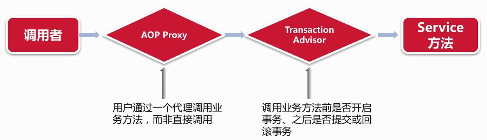

### 事务

#### ACID

```
A - Atomic 原子性
C - Consistency 一致性
I - Isolation 隔离性
D - Durability 持久性
```

#### SQL事物

```sql
BEGIN TRANSACTION;//START TRANSACTION
UPDATE t_user SET amount = amount-100 WHERE username = 'BatMan';
UPDATE t_user SET amount = amount+100 WHERE username = 'SuperMan';
COMMIT;
--ROLLBACK
```

#### JDBC事物


#### Mysql隔离级别

READ UNCOMMITED  未提交读  脏读

READ COMMITED 提交读

REPEATABLE-READ 可重复读

SERIALIZABLE  线性读

```sql
--查询隔离级别
SELECT @@GLOBAL.tx_isolation, @@tx_isolation;//后面是session的隔离级别

+-----------------------+-----------------+
| @@GLOBAL.tx_isolation | @@tx_isolation  |
+-----------------------+-----------------+
| REPEATABLE-READ       | REPEATABLE-READ |
+-----------------------+-----------------+

--设置SESSION隔离级别
SET SESSION TRANSACTION ISOLATION LEVEL READ UNCOMMITED；
```

#### Spring事物机制

##### Spring的事物抽象

- PlatformTransactionManager
- TransactionDefinition
- TransactionStatus

```java
public interface PlatformTransactionManager {
    Transaction getTransaction(TransactionDefinition definition) throws TransactionException;
    
    void commit(TransactionStatus status) throws TransactionException;
    
    void rollback(TransactionStatus status) throws TransactionException;
}

public interface TransactionDefinition {
    int getPropagationBehavior();
    int getIsolationLevel();
    String getName();
    int getTimeout();
    boolean isReadOnly();
}

public interface TransactionStatus extends SavepointManager {
    boolean isNewTransaction();
    boolean hasSavepoint();
    void setRollbackOnly();
    boolean isRollbackOnly();
    boolean isVompleted();
}
```

##### 事务隔离机制

```java
TransactionDefinition.ISOLATION_DEFAULT//默认为数据库的隔离级别
TransactionDefinition.ISOLATION_READ_UNCOMMITED
TransactionDefinition.ISOLATION_READ_COMMITED
TransactionDefinition.ISOLATION_REPEATABLE_READ
TransactionDefinition.ISOLATION_SERIALIZABLE
```

##### 事务的传播机制

```
TransactionDefinition.PROPOGATION_REQUIRED(DEFAULT)
TransactionDefinition.PROPOGATION_SUPPORTS
TransactionDefinition.PROPOGATION_MANDATORY
TransactionDefinition.PROPOGATION_REQUIRES_NEW
TransactionDefinition.PROPOGATION_NOT_SUPPORTED
TransactionDefinition.PROPOGATION_NEVER
TransactionDefinition.PROPOGATION_NESTEDED

service A 调 Service B中的方法时事务的传播：
1.B的事务为默认REQUIRED，A中有事物，B中不会新建事物，A中没有事物，B中会新建一个事物
2.SUPPORTS：B跟随A，B不会新建事务
3.MANDATORY：A必须要有事务才能调用B，否则报错
4.REQUIRES_NEW：不管A有没有事务，B都新建一个事物（A的事务会挂起），数据库事务是不允许嵌套的，这个在JTA中才会起作用
5.NOT_SUPPORTED：不支持事物，A的事务会挂起
6.NEVER：不允许有事物的存在
7.NESTEDED：嵌套事物，JDBC3.0以上支持，通过SavePoint实现的，创建了一个存盘点，内嵌事务执行完毕后可以回到这个点继续执行
```

##### Spring事物实现

- 代码方式

```java
@Service
public OrderService {
    @AutoWired
    PlatformTransactionManager txManager;
    
    void buyTicket(BuyTicketDTO dto) {
        DefaultTransactionDefinition def = new DefaultTransactionDefinition();
        def.setPropagationBehavior(TransactionDefinition.PROPOGATION_REQUIRED);
        TransactionStatus status = txManager.getTransaction(def);
        try {
            //执行业务代码
            txManager.commit(status);
        } catch(Exception e) {
            txManager.rollback(status);
        }
    }
}
```

- 注解方式（@Transactional）


```java
public OrderService {
    @Transactional
    void buyTicket(BuyTicketDTO dto) {
        //save order
        //finish customer pay
        //transfer tickets
    }
}
```

@Transactional实现原理

```java
public OrderServiceProxy {
    
    void buyTicket(BuyTicketDTO dto) {
        //get and begin tansaction manager from context
        try {
            orderServiceImpl.buyTicket(dto);
            //commit transaction
        } catch(Exception e) {
            //rollback transaction
        }
    }
}
```




##### PlatformTransactionManager的常见实现

- DataSourcePlatformTransactionManager
- JpaTransactionManager
- JmsTransactionManager
- JtaTransactionManager