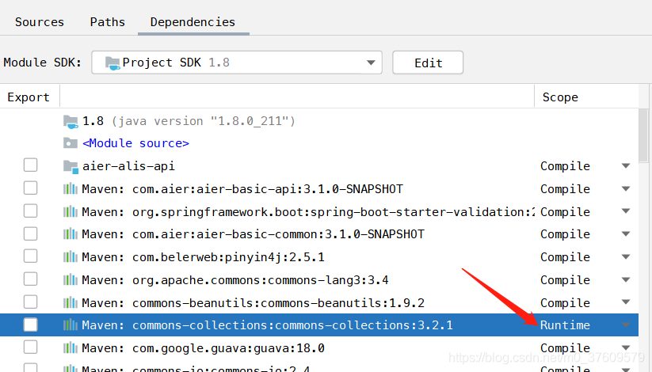

### 问题

#### 1、IDEA引入包和类后仍提示找不到方法的问题

方法一：在项目名称上右键，选择MAVEN，然后点击reimport即可。

方法二：左上角点击file，选择Invalidate Caches/Restart，然后点击左边第一个按键即可。**我的项目中此问题得以解决**。

方法三：使用方法一后，再右上角点击 toggle offline mode。

方法四：在项目配置中查看Dependencies中的scope是否是Runtime，是则更改为Compile。

