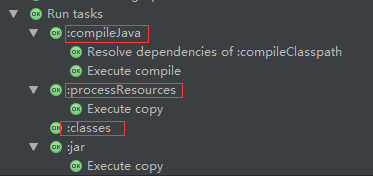

#### maven

##### 目录结构

| 目录结构           | 说明                                                         |
| ------------------ | ------------------------------------------------------------ |
| src/main/java      | application library sources - java源代码文件，会自动编译到classes文件夹下 |
| src/main/resources | application library resources - 资源库，会自动编译到classes文件夹下 |
| src/main/filters   | resources filter files - 资源过滤文件                        |
| src/main/assembly  | assembly descriptor - 组件的描述配置，如何打包               |
| src/main/config    | configuration files - 配置文件                               |
| src/main/webapp    | web application sources - web应用的目录，WEB-INF,js,css等    |
| src/main/bin       | 脚本库                                                       |
| src/test/java      | 单元测试java源代码文件                                       |
| src/test/resources | 测试需要的资源库                                             |
| src/test/filters   | 测试资源过滤库                                               |
| src/site           | 一些文档                                                     |
| pom.xml            | 工程描述文件                                                 |
| LICENSE.txt        | license                                                      |
| README.txt         | read me                                                      |
| target/            | 存放项目构建后的文件和目录，jar包,war包，编译的class文件等；Maven构建时生成的 |

##### 常用命令

```
mvn compile 编译源代码
mvn test-compile 编译测试代码
mvn test 运行测试代码
mvn package 打包
mvn install 打包并将jar包放入本地仓库
mvn clean 清除target目录
mvn eclipse:eclipse 生成eclipse项目
mvn idea:idea 生成idea项目
mvn -Dtest package 只打包不测试
mvn jar:jar 只打jar包
mvn test -skipping compile -skipping test-compile 只测试不编译，也不编译测试代码
mvn eclipse:clean 清除eclipse的一些系统设置
mvn dependency:list 查看当前项目已被解析的依赖
mvn deploy 上传到私服
mvn clean install-U 强制检查更新，由于快照版本的更新策略(一天更新几次、隔段时间更新一次)存在，如果想强制更新就会用到此命令
mvn source:jar 或 mvn source:jar-no-fork 源码打包
mvn archetype:gen 使用该命令可以生成maven项目
```

mvn compile与mvn install、mvn deploy的区别：

    mvn compile，编译类文件
    mvn install，包含mvn compile，mvn package，然后上传到本地仓库
    mvn deploy,包含mvn install,然后，上传到私服


##### maven生命周期

完整的项目构建过程包括：清理、编译、测试、打包、集成测试、验证、部署

maven的三套生命周期：

- clean 清理项目

```
pre-clean 执行清理前的工作
clean 清理上一次构建生成的所有文件（target目录）
post-clean 执行清理后的工作
```

- default 构建项目（最核心）

```
常用：compile test package install
test = compile + test
package = compile + test + package
install = compile + test + package + install
```

- site 生成项目站点

Maven可以通过site生成项目的帮助文档，并且格式为html，那么可以通过site-deploy把文档部署到远端，部署方式支持HTTP/FTP/SCM/WebDAV等。

```xml
pre-site 在生成项目站点前要完成的工作
site 生成项目的站点文档
post-site 在生成项目站点后要完成的工作xml
site-deploy 发布生成的站点到服务器上

pom中添加
<distributionManagement>
    <site>
        <id>tomcatserver</id>
        <url>dav:http://127.0.0.1:8080/webdav/</url>
    </site>
</distributionManagement>
<build>
    <finalName>testproject</finalName>
    <extensions>
        <extension>
            <groupId>org.apache.maven.lifeix</groupId>
            <artifactId>lifeix-webdav-jackrabbit</artifactId>
            <version>1.0-beta-7</version>
        </extension>
    </extensions>
</build>

setting.xml中添加：
<servers>
    ...
    <server>
        <id>tomcatserver</id>
        <username>root</username>
        <password>root</password>
    </server>
    ...
</servers>
```


##### pom

```xml
<project xmlns="http://maven.apache.org/POM/4.0.0" xmlns:xsi="http://www.w3.org/2001/XMLSchema-instance"
  xsi:schemaLocation="http://maven.apache.org/POM/4.0.0 http://maven.apache.org/xsd/maven-4.0.0.xsd">
  <!-- 指定当前pom版本 -->
  <modelVersion>4.0.0</modelVersion>

  <groupId>com.lifex</groupId> <!-- 反写的公司域名+项目名 -->
  <artifactId>testMvn</artifactId> <!-- maven的项目是模块化的：项目名+模块名 -->
  <!-- 0.0.1 snapshot
               第一个0表示大版本号，第二个0表示分支版本号，第三个0表示小版本号
     snapshot 快照版本
     alpha 内部测试
     beta 公测
     release 稳定
     GA 正式发布
  -->
  <version>0.0.1-SNAPSHOT</version>
  <packaging>jar</packaging> <!-- 默认是jar，可配war、zip、pom等 -->

  <name>testMvn</name> <!-- 项目名称 -->
  <url>http://maven.apache.org</url> <!-- 项目地址 -->
  <description>项目描述</description>
  <developers></developers><!-- 项目开发人员名单 -->
  <licenses></licenses>
  <organization></organization>

  <properties>
    <project.build.sourceEncoding>UTF-8</project.build.sourceEncoding>
  </properties>

  <dependencies>
    <dependency>
      <groupId>junit</groupId>
      <artifactId>junit</artifactId>
      <version>3.8.1</version>
      <scope>test</scope>
      <!-- false，默认，子项目会继承该依赖
           true，子项目如果需要，则自己显示引用该依赖，不能继承 -->
      <optional></optional>
      <type>bar</type> <!-- 依赖类型，默认是jar -->  
      <!-- 排除依赖传递列表，比如spring中依赖很多其他jar，可以在这里排除 -->
      <exclusions>
        <exclusion></exclusion>
      </exclusions>
    </dependency>
  </dependencies>
  
  <!-- 依赖管理：一般用于父模块中，供子模块继承使用，
       比如Junit子类都会使用，可以抽取出来放入父模块中 
       其他模块也可以import，scope=import  
       父模块中不会运行              
  -->
  <dependencyManagement>
    <dependencies></dependencies>
  </dependencyManagement>
  
  <!-- 为构建的行为添加相应的支持 -->
  <build>
    <plugins>
      <plugin>
        <groupId>org.apache.maven.plugins</groupId>
        <artifactId>maven-source-plugin</artifactId>
        <version>2.4</version>
        <!-- 执行package时，给源代码打包 -->
        <!-- clean package = clean + compile + test + jar package + source package -->
        <executions>
            <execution>
                <phase>package</phase>
                <goals>
                    <goal>jar-no-fork</goal>
                </goals>
            </execution>
        </executions>
      </plugin>
    </plugins>
  </build>
</project>
```

- 依赖范围

maven中提供了三种classpath：编译、测试、运行

官网参考：https://maven.apache.org/guides/introduction/introduction-to-dependency-mechanism.html

<scope>用来控制依赖于三种classpath的关系的

```
compile：默认的范围，编译测试运行都有效
provided：编译和测试有效，运行时无效，比如java ee项目中可以依赖servlet，但是运行时不需要，因为web容器中已经提供了servlet，要避免冲突
runtime：在测试和运行时有效，比如jdbc驱动，在编译时是不需要的，只有运行时才需要
test：测试时有效，junit
system：类似provided，编译和测试有效，与本机系统相关联，如本机的java home，移植性差
import：导入的范围，它只使用在dependencyManagement中，表示从其他的pom中导入dependency的配置
```

- 依赖冲突

两个原则：

1）短路优先

```
A--->B--->C--->X(1.0.jar)
A--->D--->X(1.1.jar)
A会选择下面的X中的1.1.jar
```

2）路径长度相同的情况下，先声明优先

- 聚合和继承

```xml
<project>
    ...
  <packaging>pom</packaging>
  <!--  可以将模块都聚合在一起，构建时无需单独构建每个模块  -->
  <modules>
    <module>../module1</module>
    <module>../module2</module>
    <module>../module3</module>
  </modules>
    
  <dependencyManagement>
    <dependencies></dependencies>
  </dependencyManagement>
    ...
</project>
```

继承，可以多层继承

```xml
父模块：
<project>
    ...
  <groupId>com.test</groupId>
  <artifactId>parent</artifactId>
  <version>1.0.0</version>
  <packaging>pom</packaging>
    
  <properties>
    <junit.version>3.8.1</junit.version>
    <projectVersion>1.0.0</projectVersion>
    <project.build.sourceEncoding>UTF-8</project.build.sourceEncoding>
  </properties>
    
  <dependencyManagement>
      <dependencies>
        <dependency>
          <groupId>junit</groupId>
          <artifactId>junit</artifactId>
          <version>${junit.version}</version>
          <scope>test</scope>
        </dependency>
    </dependencies>
  </dependencyManagement>
    ...
</project>

子模块：
<project>
    ...
  <parent>
    <groupId>com.test</groupId>
    <version>${projectVersion}</version>
    <artifactId>child</artifactId>
  </parent>
    
  <dependencies>
    <dependency>
      <groupId>junit</groupId>
      <artifactId>junit</artifactId>
    </dependency>
  </dependencies>
    ...
</project>
```


#### gradle

##### groovy

```groovy
//支持java语法
class ProjectVersion { //默认public
    private int major //;可以有可以没有
    private int minor

    ProjectVersion(int major, int minor) {
        this.major = major
        this.minor = minor
    }
    //自动生成setter、getter方法，方法返回最后一行表达式，可以省略return
}

ProjectVersion projectVersion = new ProjectVersion(1,2)
println projectVersion.minor
ProjectVersion projectVersion2
println projectVersion2 == projectVersion //false，没有nullPointerException
```

```groovy
//groovy的高效特性
//1 可选的类型定义
def version = 1

//2 assert
//assert version == 2

//3 括号是可选的
//println version

//4 字符串
def s1 = '我是普通字符串'
def s2 = "我可以引用变量：${version}"
def s3 = '''我
可以
换行！'''
//println s1
//println s2
//println s3

//集合api
//list
def buildTools=['ant','maven']
buildTools << 'gradle'
//assert buildTools.getClass() == ArrayList
//assert buildTools.size() == 3
//map
def buildYears = ['ant':2000,'maven':2004]
buildYears.gradle = 2009

//println buildYears.gradle
//println buildYears['ant']
//println buildYears.getClass() //java.util.LinkedHashMap

//6 闭包
def c1 = {
    v ->
        print v
}

def c2 = {
    print 'hello'
}

def method1(Closure closure) {
    closure('param')
}

def method2(Closure closure) {
    closure()
}

method1(c1)
method2(c2)
```

##### 构建脚本

###### 项目（project）

一个项目代表一个正在构建的组件（比如一个jar文件），当构建启动后，Gradle会基于build.gradle实例化一个org.gradle.api.Project类，并且能够通过project变量使其隐式可用。

```groovy
//构建脚本中默认都是有个Project实例的，作用域为该实例

//Project属性：group、name、version，可以用来确定唯一的坐标
//name类似maven中artifactId，在settings.gradle中设置
group 'com.lifeix.gradle' //project.group = 'com.lifeix.gradle'
version '1.0-SNAPSHOT'
//Project常用方法：apply、dependencies、repository、task
apply plugin:'java'

repositories {
    mavenCentrals()
}

dependencies {
    compile 'commons-codec:commons-codec:1.6'
}
```

属性的其他配置方式：ext、gradle.properties

###### 任务（Task）

任务一般用gradle插件来运行，如clean、jar等，也可以自己编写任务

下图是运行jar后的截图，可以看出，jar依赖于其他任务



自己编写任务，在other里面


##### 构建生命周期


初始化：创建Project实例，初始化所有需要构建的项目

配置：生成Task的依赖关系以及执行顺序，简单点说就是初始化任务

执行：动作代码，执行task，下面代码只有doLast与doFirst是执行代码，其他都是配置

```groovy
def createDir = {
    path ->
        File dir = new File(path)
        if(!dir.exists()) {
            dir.mkdirs()
        }
}

task makeJavaDir() {
    def paths = ['src/main/java','src/main/resources','src/test/java','src/test/resources']
    doFirst {
        paths.forEach(createDir)
    }
}

task makeWebDir() {
    dependsOn 'makeJavaDir'
    def paths = ['src/main/webapp','src/test/webapp']
    doLast {
        //dependsOn 'makeJavaDir' //这里会报错
        paths.forEach(createDir)
    }
}
```


##### 依赖管理

###### 工件坐标：

group、name、version

###### 常用仓库：

1）mavenLocal/mavenCentral/jcenter

2）自定义maven仓库

3）文件仓库，本地的仓库，不建议使用

```groovy
repositories {
    //配置私服，一般放在最前面，按顺序查找
    maven {
        url 'http://maven.aliyun.com/nexus/content/groups/public/'
    }
    mavenLocal()
    mavenCentral()
}
```

###### 依赖管理：


版本冲突：


解决冲突：

1）查看依赖报告

2）排除传递性依赖

```groovy
compile('org.hibernate:hibernate-core:3.6.3.Final') {
    exclude group:"org.slf4j",module:"slf4j-api"//module=name
    //transitive = false
}
```

3）强制一个版本，gradle默认是最新的版本

```groovy
configurations.all {
    resolutionStrategy {
        force 'org.slf4j:slf4j-api:1.7.24'
    }
}
```

4）修改默认解决策略

```groovy
configurations.all {
    resolutionStrategy {
        failOnVersionConflict()//冲突失败
    }
}
```

gradle默认：


点击dependencies，可以看到真正的依赖


增加冲突失败策略后build：


